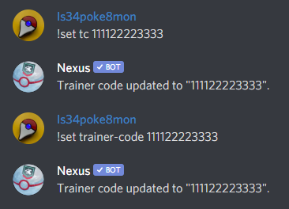
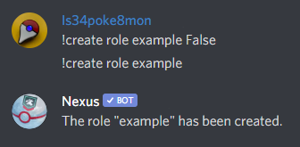

# Command Usage

> Commands shown on this site are using the default prefix `!`, please note server admin's can change the prefix to best suit their community. 
>
> Commands in `[ ]` are showing aliases that perform the same task, and `< >` are used to show the desired input.
>
> Example message entry in Discord for `!set [tc|fc|trainer-code|friend-code] <trainer_code>` would be `!set tc 111122223333` or `!set trainer-code 111122223333`.
>
> 

```eval_rst

.. # define a hard line break for HTML
..  |img| raw:: html

   

.. Note:: when a command has an input of ``<verbose=True>`` this means Nexus will return a response by default. To override the command response enter ``False``.

   Example: ``!create role <arg> <verbose=True>``
   
   |img|


```