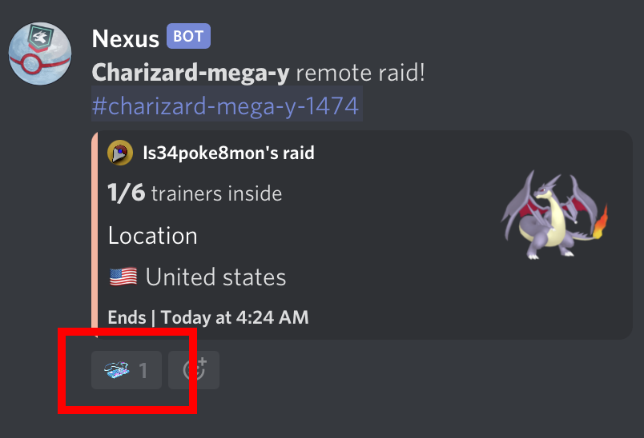
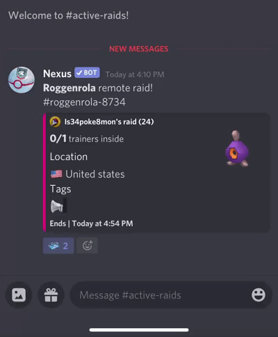
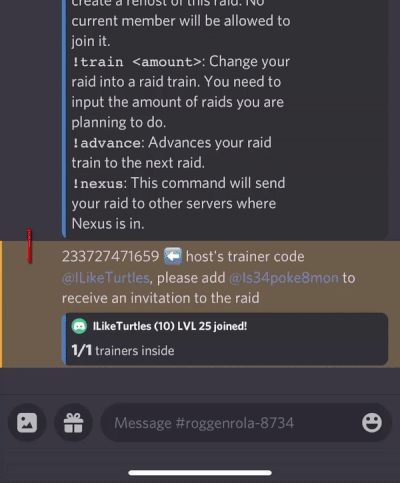
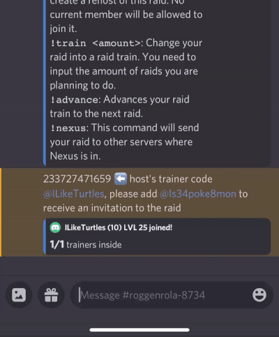
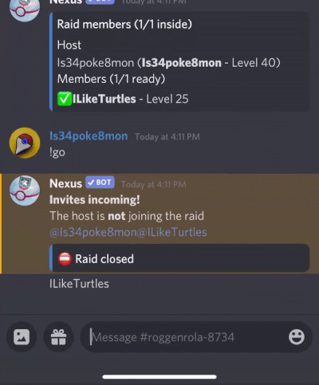

# Joining Raids

> In the "raid-channel" setup for the community, Trainers can join raids by clicking the "raid pass", and Nexus will prompt the Trainer to join the raid lobby. <a class="reference internal" href="#example-walk-through-steps">(See example below)</a>
>
>> 

## Raid Lobby Commands

```eval_rst

.. csv-table::
   :header: "Command", "Description"
   :widths: 20, 80

   ``!bye``, "Use this to leave a raid. If you are the Host the raid will end."
   ``!host``, "Use this in a raid to get information from the host."
   ``!ready``, "Use this to mark yourself as ready inside a raid."
   ``!time-left``, "Use this in a raid to see how much time is left on the raid."
   ``!unready``, "Use this to mark yourself as unready inside a raid."

.. Tip:: Nexus recognizes the word ``ready`` in the raid lobby so using ``!ready`` is optional.

```

## Example walk through (steps)

**1. Click the "raid pass".**

>> 


**2. Click the link (or notification) to enter the raid lobby.**

>> 


**3. Once in the lobby copy the Host's friend code and paste it in the Pokémon Go app.**

>> 


**4.Return to Discord and let the Host know you're ready and wait for the invite notification.**

>> 


**5. Return to Pokémon Go app and wait for the raid invite.**

>> 


**6. After the raid has ended return to Discord and use the `!bye` command to leave the raid.**

>> 


## Example walk through (full)

>> <a href="../_static/img/full.gif"></a>